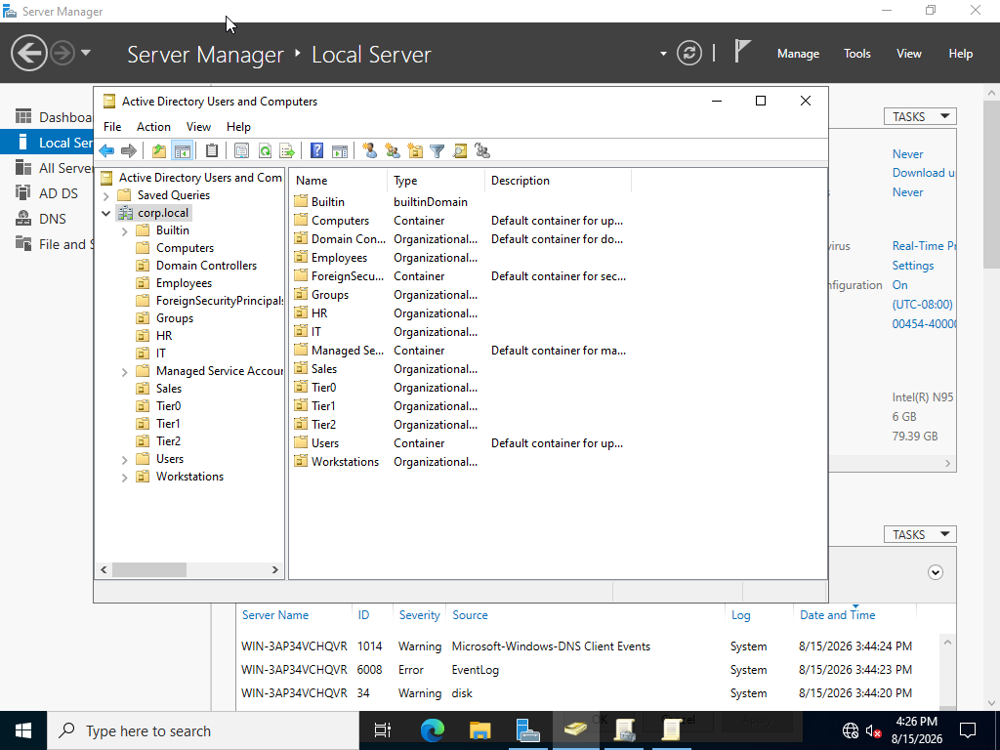
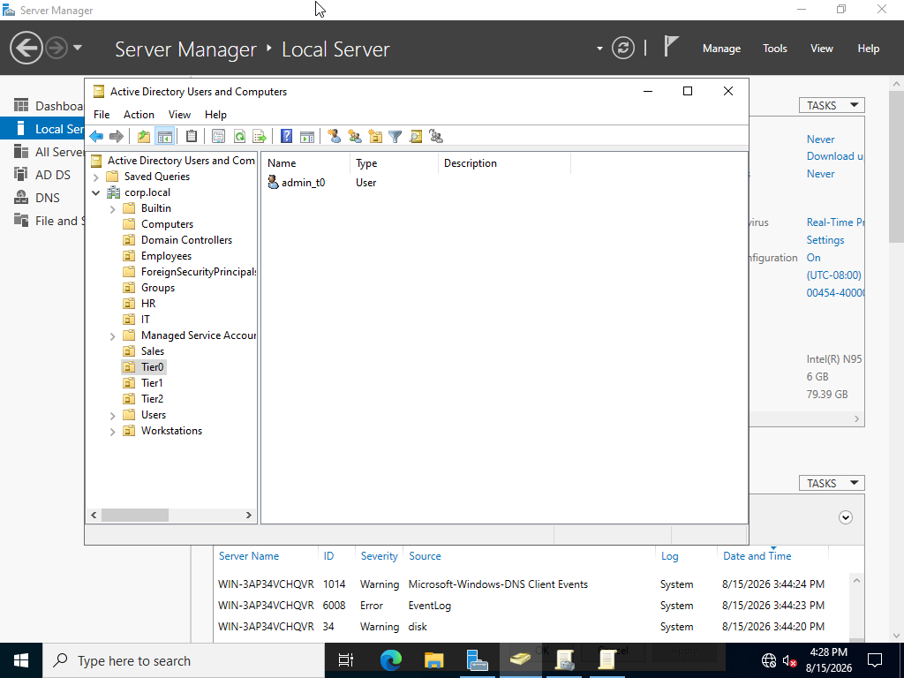
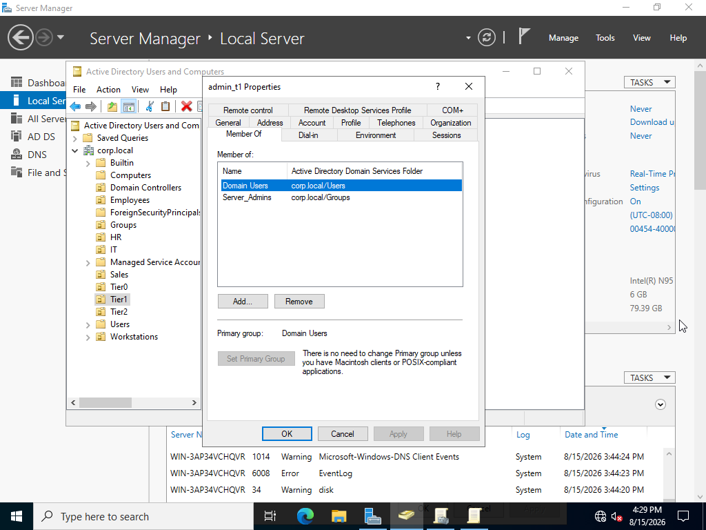
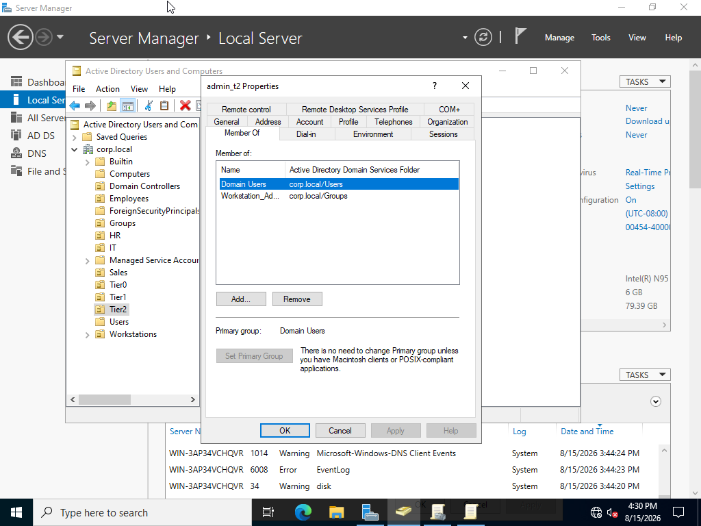
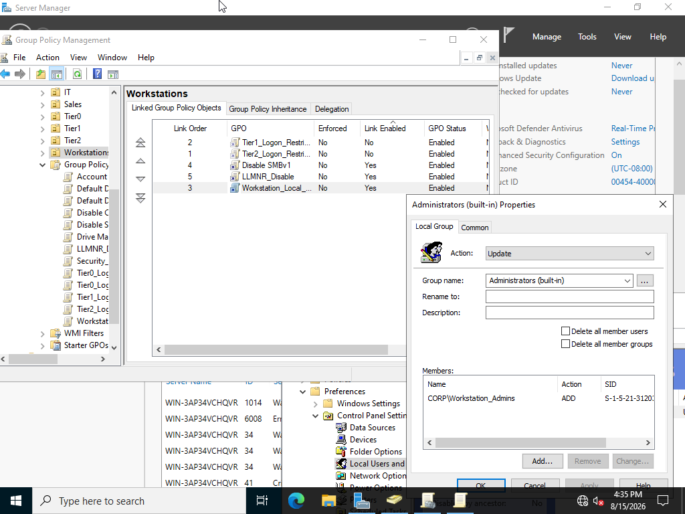
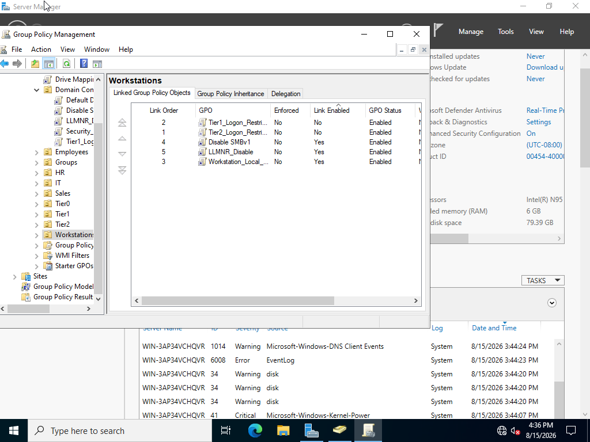
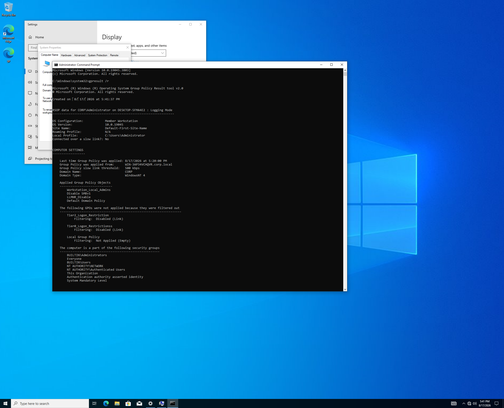
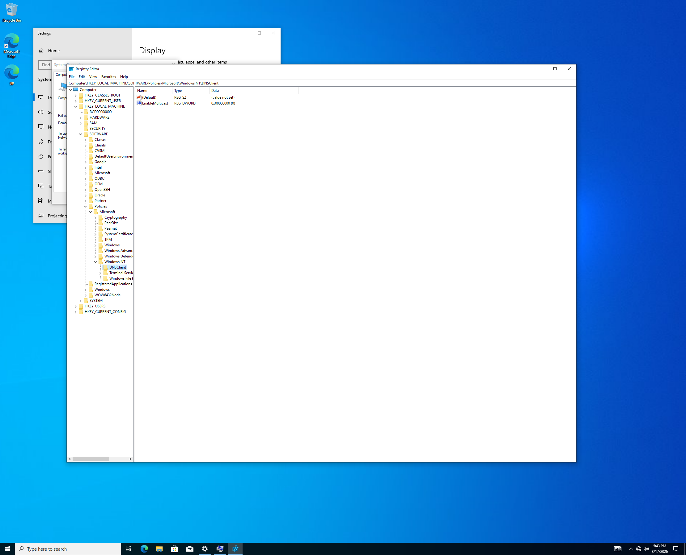
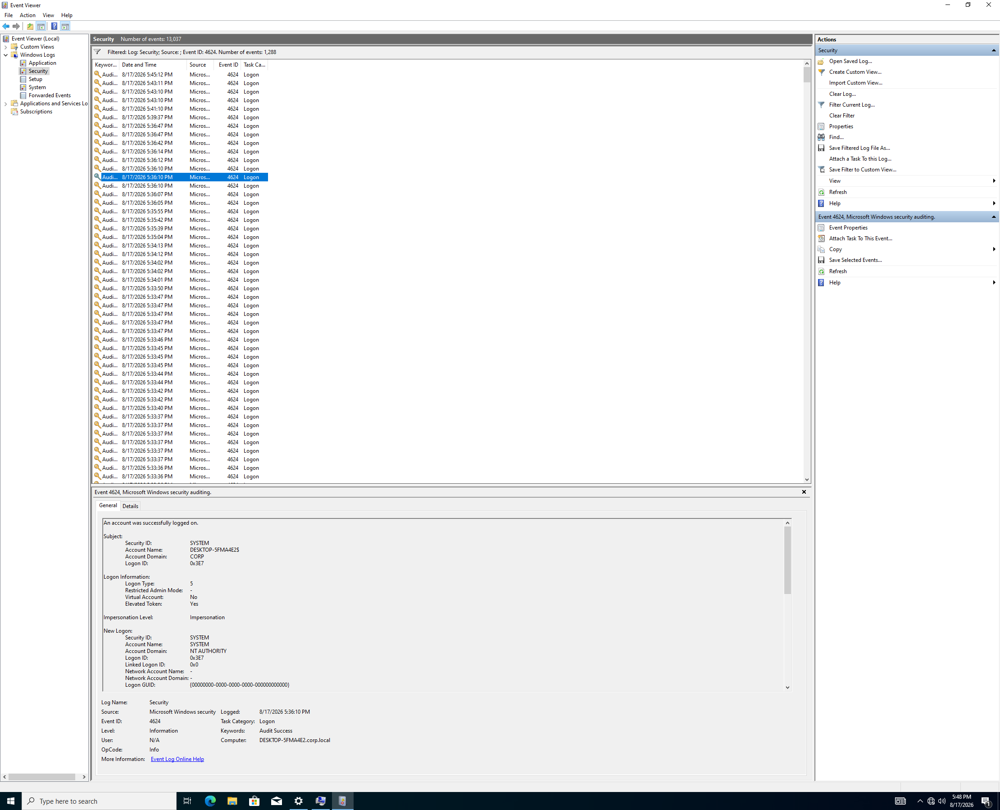
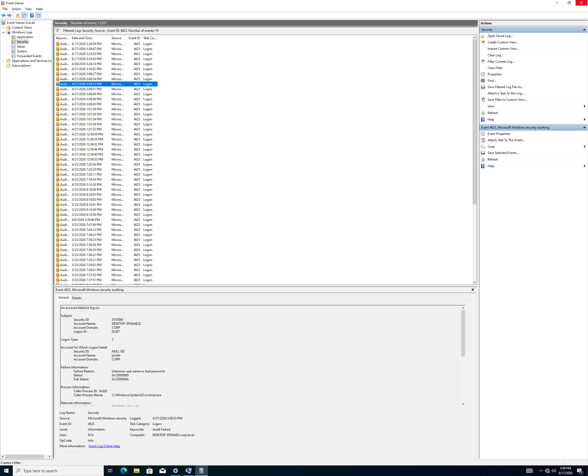

# Active Directory Home Lab

## Overview

Designed and implemented a Windows Server 2022 Active Directory environment in VirtualBox to practice identity management, administrative privilege separation, Group Policy, endpoint security hardening, DNS, and Windows security monitoring.

The lab was built to simulate a small business domain environment and demonstrate practical security administration skills.

---

## Lab Environment

| Component | Configuration |
|---|---|
| Hypervisor | Oracle VirtualBox |
| Domain Controller | Windows Server 2022 |
| Client | Windows 10 |
| Domain | `corp.local` |
| Domain Controller Hostname | `WIN-3AP34VCHQVR` |
| Directory Services | Active Directory Domain Services |
| DNS | Windows Server DNS |

---

## Objectives

- Deploy and configure an Active Directory domain
- Organize users and computers using Organizational Units
- Implement tiered administrative accounts
- Apply role-based administrative groups
- Configure and deploy Group Policy
- Restrict local administrator access on workstations
- Disable LLMNR on domain workstations
- Configure Windows logon auditing
- Verify Group Policy application
- Monitor Windows authentication events
- Validate DNS integration with Active Directory
- Practice security configuration validation and troubleshooting

---

## Active Directory Structure

The domain was organized using departmental, administrative, and workstation Organizational Units.

```text
corp.local
├── Employees
├── HR
├── IT
├── Sales
├── Tier0
├── Tier1
├── Tier2
└── Workstations
```
Department Organization
| OU        | Example Account         |
| --------- | ----------------------- |
| Employees | Your Rage, Jared Mccain |
| HR        | Michael Jordan          |
| IT        | John Smith              |
| Sales     | Alice Doe               |

Tiered Administrative Model

A tiered administrative model was implemented to separate privileged access based on administrative responsibilities.

Tier 0 — Domain Administration

Account: AdminT0

Group memberships:

Domain Admins
Domain Users

Tier 0 represents the highest level of administrative privilege within the lab and is responsible for domain-level administration.

Tier 1 — Server Administration

Account: admin_t1

Group memberships:

Server Admins
Domain Users

Tier 1 separates server administration from domain-level administration.

Tier 2 — Workstation Administration

Account: admin_t2

Group memberships:

Workstation Admins
Domain Users

Tier 2 separates workstation administration from higher-level domain and server administration.

This structure demonstrates the principles of least privilege, privilege separation, and role-based administrative access.

Administrative Security Groups
Server Admins

The Server Admins security group contains:

admin_t1

This group was used to separate server administration from domain-level administrative privileges.

Workstation Admins

The Workstation Admins security group contains:

admin_t2

This group was used to manage workstation-level administrative access.

Group Policy Configuration

The following custom Group Policy Objects were created during the lab:

Tier0_Logon_Restrictions
Tier1_Logon_Restrictions
Tier2_Logon_Restrictions
Workstation_Local_Admins
Disable SMBv1
LLMNR_Disable
Security_Auditing
Drive Mapping Policy
Disable Control Panel
Workstation GPO Deployment

The following GPOs were linked to the Workstations OU:

Tier1_Logon_Restrictions
Tier2_Logon_Restrictions
Workstation_Local_Admins
Disable SMBv1
LLMNR_Disable
Sales GPO Deployment

The following GPO was linked to the Sales OU:

Disable Control Panel
Domain Controller GPO Deployment

The following GPO was linked to the Domain Controllers OU:
Security_Auditing

Workstation Local Administrator Management

The Workstation_Local_Admins GPO was configured using Group Policy Preferences.

The policy was configured to:

| Setting     | Configuration             |
| ----------- | ------------------------- |
| Action      | Update                    |
| Local Group | `Administrators`          |
| Member      | `corp\Workstation_Admins` |

This configuration provides centralized management of workstation administrative privileges.

The administrative access flow was:

admin_t2
    ↓
Workstation Admins
    ↓
Workstation_Local_Admins GPO
    ↓
Local Administrators Group
    ↓
Domain Workstations
This demonstrates centralized endpoint privilege management and supports the principle of least privilege.

LLMNR Security Hardening

The LLMNR_Disable GPO was configured to:

Turn off multicast name resolution = Enabled

The GPO was linked to the Workstations OU.

The configuration was independently verified on the Windows 10 workstation.

The following registry configuration was observed:

HKEY_LOCAL_MACHINE
└── SOFTWARE
    └── Policies
        └── Microsoft
            └── Windows NT
                └── DNSClient

With:
EnableMulticast = 0

This confirms that multicast name resolution was disabled on the workstation after Group Policy application.

The configuration was verified through multiple stages:

LLMNR_Disable GPO
        ↓
GPO linked to Workstations
        ↓
Windows 10 receives GPO
        ↓
EnableMulticast = 0

This security control was implemented to reduce the risk associated with legacy multicast name-resolution protocols and credential interception attacks.

Security Auditing

A Security_Auditing GPO was configured and linked to the Domain Controllers OU.

Audit Logon
Success: Enabled
Failure: Enabled

This configuration provides visibility into successful and unsuccessful authentication attempts on the Domain Controller.

The configuration supports security monitoring and investigation using Windows Security Event Logs.

Windows Authentication Event Monitoring

Windows Event Viewer was used to review authentication activity in:

Windows Logs → Security

Event ID 4624 — Successful Logon

A successful logon event was identified and reviewed.

Event ID 4624 can provide information about authentication activity including:

Account information
Logon type
Workstation information
Authentication details
Source information when available
Event ID 4625 — Failed Logon

A failed logon event was identified and reviewed.

Event ID 4625 can provide information about unsuccessful authentication attempts including:

Account information
Failure reason
Logon type
Workstation information
Source information when available

These events demonstrate how Windows security auditing can provide data for authentication monitoring and security investigations.

Group Policy Verification

The Windows 10 workstation was verified as a member of the corp.local domain.

The gpresult /r command was used to verify the Group Policy Objects applied to the workstation.

This provided endpoint-level verification that the workstation received the expected Group Policy configuration.

The verification process was:

GPO Created
    ↓
GPO Linked to OU
    ↓
Windows 10 Domain-Joined
    ↓
Group Policy Applied
    ↓
gpresult Verification

This demonstrates practical Group Policy deployment and troubleshooting skills.

DNS Configuration

The Windows Server 2022 Domain Controller also provided DNS services for the Active Directory environment.

The corp.local Forward Lookup Zone was verified through Windows DNS Manager.

DNS is a critical component of Active Directory because domain services rely heavily on DNS for locating domain controllers and other domain resources.

Security Configuration Validation

An important part of this lab was validating the actual configuration rather than relying solely on the names of Group Policy Objects.

During validation, the GPO named:

Disable SMBv1

was found to contain the following configured setting:

Lanman Workstation → Enable insecure guest logons = Enabled

No SMBv1-specific setting was found configured under the inspected Lanman Server or Lanman Workstation policy areas.

Therefore, the lab does not claim that SMBv1 was successfully disabled.

This finding demonstrates the importance of validating the effective configuration of security controls rather than assuming that a GPO name accurately represents what the policy actually does.

Lessons Learned

This lab reinforced several important cybersecurity and systems administration concepts.

1. Least Privilege

Administrative accounts should receive only the level of access required for their responsibilities.

2. Privilege Separation

Separating domain, server, and workstation administration reduces the need to use highly privileged accounts for routine tasks.

3. Group Policy Management

Security policies must be both configured and correctly linked to the appropriate Organizational Units.

4. Configuration Verification

Creating a security policy does not necessarily mean the intended security control has been implemented.

The actual configuration must be verified.

5. Endpoint Validation

Tools such as gpresult, Registry Editor, and Event Viewer can be used to verify that policies are reaching endpoints and producing the expected results.

6. Security Monitoring

Windows authentication events such as 4624 and 4625 provide useful telemetry for investigating authentication activity.

Skills Demonstrated
Active Directory
Active Directory Domain Services
Active Directory Users and Computers
Organizational Unit design
User management
Security group management
Tiered administrative models
Role-Based Access Control concepts
Least privilege
Windows Server
Windows Server 2022
Domain Controller administration
DNS
Group Policy Management
Group Policy Preferences
Windows security auditing
Endpoint Security
Windows 10 domain joining
Local administrator management
LLMNR mitigation
Group Policy deployment
Endpoint configuration verification
Security Monitoring
Windows Event Viewer
Windows Security Event Logs
Event ID 4624
Event ID 4625
Authentication monitoring
Security configuration validation
Tools
Oracle VirtualBox
Active Directory Users and Computers
Group Policy Management
DNS Manager
Event Viewer
Registry Editor
gpresult

## Evidence

### Active Directory Structure



### Tiered Administrative Model

#### Tier 0 — Domain Administration



#### Tier 1 — Server Administration



#### Tier 2 — Workstation Administration



### Workstation Local Administrator Management



### Workstation GPO Deployment



### Group Policy Verification



### LLMNR Endpoint Verification



### Windows Authentication Monitoring

#### Event ID 4624 — Successful Logon



#### Event ID 4625 — Failed Logon



Screenshots documenting the lab configuration and verification process are available in the screenshots directory.

The evidence includes:

Server environment
Active Directory structure
Tiered administrative accounts
Administrative security groups
Group Policy configuration
Group Policy deployment
Windows 10 domain membership
Group Policy verification
LLMNR configuration and endpoint verification
Windows authentication events
DNS configuration
Active Directory Structure

The Active Directory environment was organized into departmental, administrative, and workstation Organizational Units.

Tiered Administrative Model

The lab implemented separate administrative tiers for domain, server, and workstation administration.

Workstation Local Administrator Management

The Workstation_Local_Admins GPO was configured to add the corp\Workstation_Admins security group to the local Administrators group on domain workstations.

Group Policy Deployment

The Workstations OU was configured with security-related Group Policy Objects including LLMNR mitigation, workstation administrative controls, and logon restrictions.

LLMNR Endpoint Verification

The LLMNR security configuration was verified on the Windows 10 workstation with:

EnableMulticast = 0

Group Policy Verification

The gpresult /r command was used to verify that the expected Group Policy Objects were applied to the Windows 10 workstation.

Windows Authentication Monitoring

Windows Security Event Viewer was used to review successful and failed authentication activity.

Successful Logon — Event ID 4624

Failed Logon — Event ID 4625

Conclusion

This lab provided hands-on experience designing, implementing, securing, and validating a Windows Active Directory environment.

The project demonstrates the relationship between:

Identity Management
        ↓
Administrative Privilege Separation
        ↓
Group Policy Security Controls
        ↓
Endpoint Configuration
        ↓
Security Auditing
        ↓
Authentication Monitoring
        ↓
Security Validation

The lab was built as a practical cybersecurity learning environment and was continuously validated to ensure that documented configurations accurately reflected the implemented environment.

