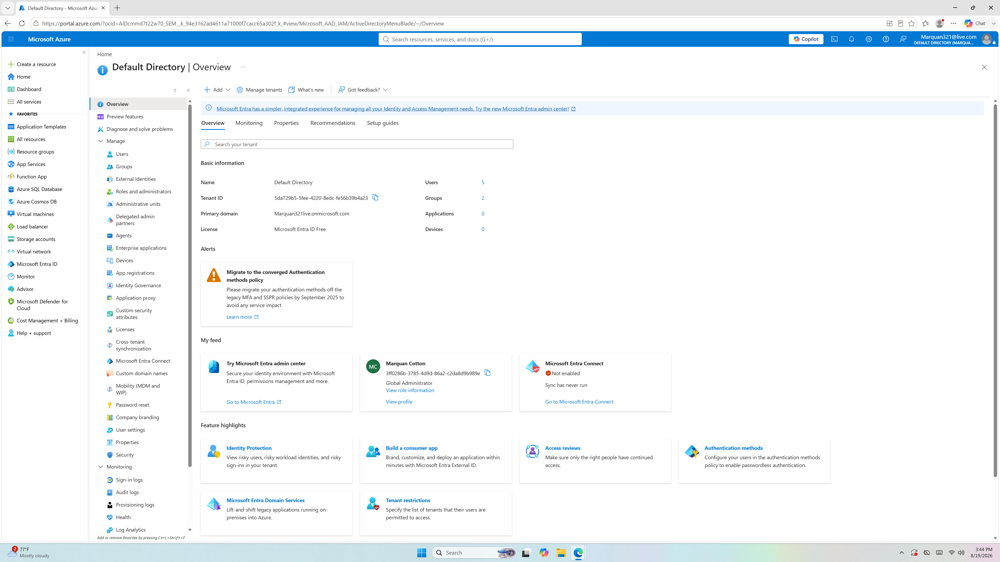
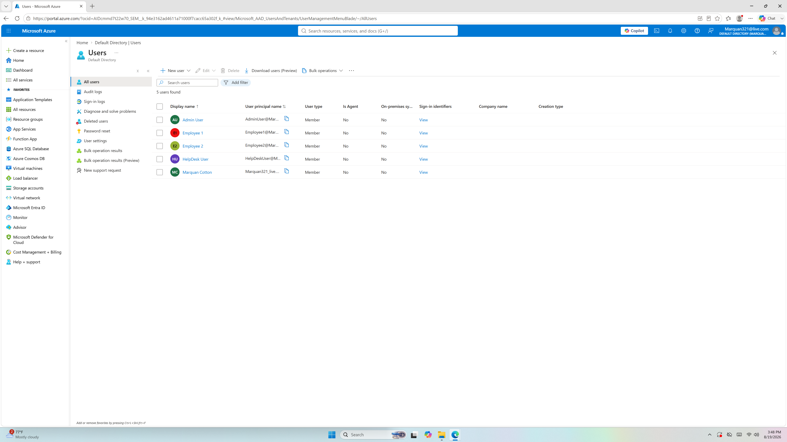
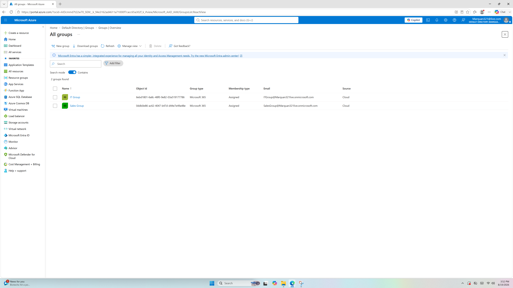
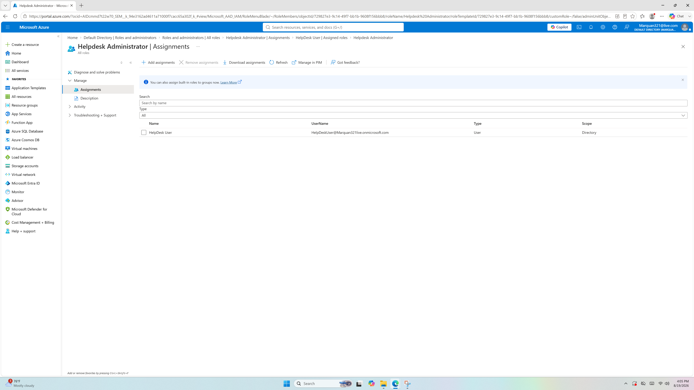
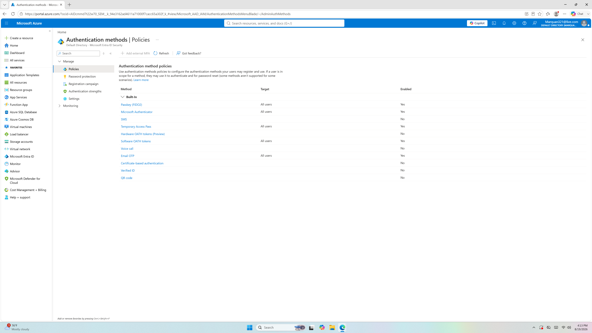
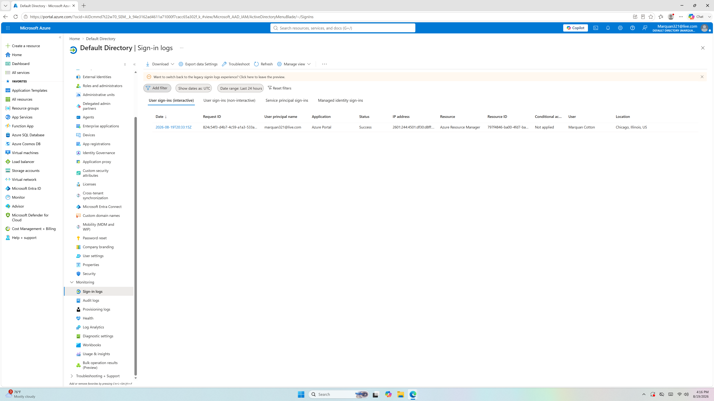
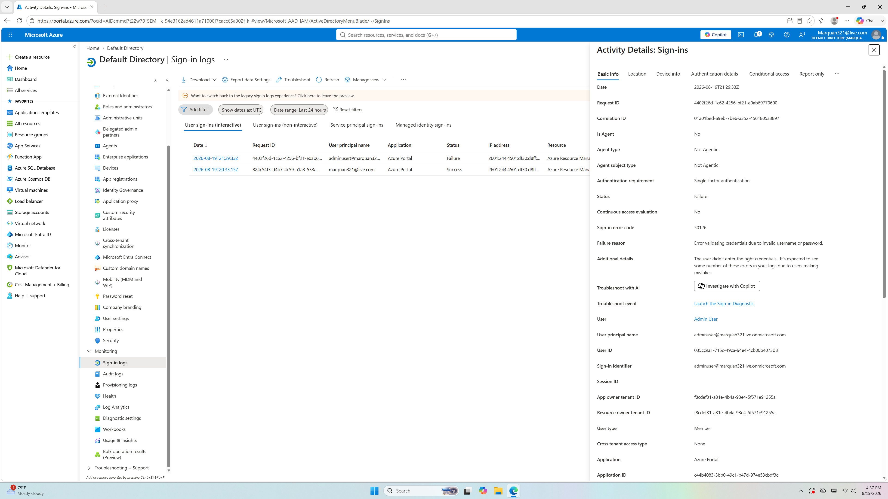
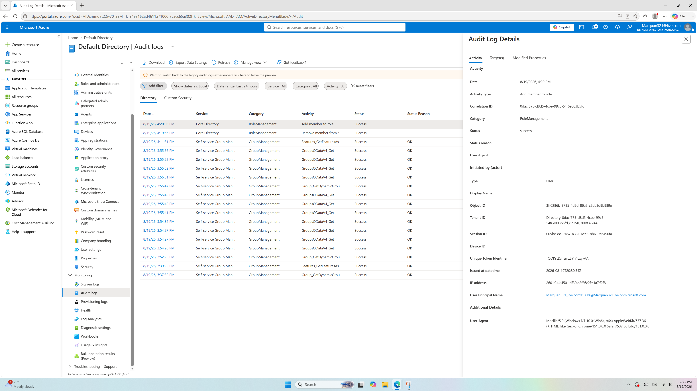

# Microsoft Entra ID Identity & Security Lab

## Overview

Designed and implemented a Microsoft Entra ID environment to practice cloud identity management, security group organization, role-based access control, authentication security, and security monitoring.

The lab simulates a small business cloud identity environment and demonstrates practical Microsoft Entra ID administration and security investigation skills.

---

## Lab Environment

| Component | Configuration |
|---|---|
| Identity Platform | Microsoft Entra ID |
| Cloud Users | 5 |
| Security Groups | 2 |
| Administrative Roles | Global Administrator, Helpdesk Administrator |
| Authentication Methods | Passkey, Microsoft Authenticator, Temporary Access Pass, Software OATH tokens, Email OTP |
| Monitoring | Sign-in Logs, Audit Logs |

---

## Objectives

- Manage cloud identities using Microsoft Entra ID
- Organize users using security groups
- Implement role-based access control
- Demonstrate least-privilege administrative access
- Configure and review authentication methods
- Analyze successful authentication events
- Investigate failed authentication events
- Review administrative audit activity
- Validate identity and security configurations

---

## Identity Structure

The environment contains five cloud identities:

- `Admin User`
- `Employee 1`
- `Employee 2`
- `HelpDesk User`
- `Me`

The identities were organized according to their simulated responsibilities within the environment.

### Security Groups

Two security groups were configured:

| Security Group | Members |
|---|---|
| IT Group | Admin User, HelpDesk User |
| Sales Group | Employee 1, Employee 2 |

The group structure demonstrates centralized identity organization and provides a foundation for role-based access management.

---

## Active Identity Structure

```text
Microsoft Entra ID
│
├── IT Group
│   ├── Admin User
│   └── HelpDesk User
│
└── Sales Group
    ├── Employee 1
    └── Employee 2
```
This structure separates simulated IT personnel from business users and demonstrates the use of security groups to organize cloud identities.

Role-Based Access Control

Role-based access control was implemented using Microsoft Entra administrative roles.

Global Administrator

Admin User was assigned the Global Administrator role.

This role represents the highest level of administrative access in the lab and is used for tenant-level administration.

Helpdesk Administrator

HelpDesk User was assigned the Helpdesk Administrator role.

The Helpdesk Administrator role provides delegated administrative capabilities appropriate for help desk operations without requiring full Global Administrator privileges.

The administrative model was structured as:
Global Administrator
        │
        ↓
   Admin User
        │
        ↓
Tenant Administration


Helpdesk Administrator
        │
        ↓
  HelpDesk User
        │
        ↓
Delegated Help Desk Administration

This demonstrates the principle of least privilege by separating full tenant administration from delegated help desk responsibilities.

Authentication Methods

The Entra ID environment was configured with multiple authentication methods.

The available authentication methods documented during the lab included:

Passkey
Microsoft Authenticator
Temporary Access Pass
Software OATH tokens
Email OTP

These methods provide multiple mechanisms for authenticating users and support stronger identity security than password-only authentication.

Authentication Monitoring

Microsoft Entra sign-in logs were used to review authentication activity.

The lab documented both successful and unsuccessful authentication events.

The investigation workflow was:

User Authentication
        ↓
Microsoft Entra Sign-In
        ↓
Authentication Result
        ↓
Sign-In Log
        ↓
Security Investigation

Successful Authentication

A successful authentication event was reviewed using Microsoft Entra sign-in logs.

The event was examined for available authentication and sign-in information such as:

User
Date and time
Application
Authentication status
Authentication requirements
Authentication details
Location or source information when available

This demonstrates the ability to use Microsoft Entra sign-in telemetry to investigate authentication activity.

Failed Authentication

A controlled failed authentication test was performed using a lab account.

An intentionally incorrect password was entered once to generate an unsuccessful authentication event.

The resulting sign-in event was reviewed in Microsoft Entra sign-in logs.

This demonstrates how failed authentication activity can be identified and investigated through cloud identity telemetry.

The test was intentionally limited to a single controlled failure and was performed only within the lab environment.

Audit Log Investigation

Microsoft Entra audit logs were reviewed to investigate administrative activity.

The Helpdesk Administrator role assignment was used as an example of an administrative directory change.

The audit event was reviewed for information including:

Activity
Target
Initiated by
Date and time
Result

This demonstrates how Microsoft Entra audit logs can be used to determine what administrative changes occurred, who initiated them, and whether the operation succeeded.

The investigation workflow was:

Administrative Change
        ↓
Microsoft Entra Directory
        ↓
Audit Log
        ↓
Activity Review
        ↓
Security Investigation

Security Monitoring

The lab demonstrates two complementary sources of Microsoft Entra security telemetry:

Sign-In Logs

Used to investigate authentication activity.

Examples include:

Successful authentication
Failed authentication
Authentication method information
Application access
Source and location information when available
Audit Logs

Used to investigate administrative and directory changes.

Examples include:

Role assignments
User changes
Group changes
Directory configuration changes

Together, these logs provide visibility into both authentication activity and administrative activity.

## Evidence

The following screenshots document the configuration and investigation activities performed during the lab.

### Entra ID Environment



### Entra ID Users



### Security Groups



### Helpdesk RBAC



### Authentication Methods



### Successful Sign-In Investigation



### Failed Sign-In Investigation



### Audit Log Investigation



Skills Demonstrated
Microsoft Entra ID
Cloud identity management
Microsoft Entra ID administration
User management
Security group management
Identity organization
Identity & Access Management
Role-Based Access Control
Global Administrator
Helpdesk Administrator
Least privilege
Delegated administration
Security group-based organization
Authentication Security
Passkeys
Microsoft Authenticator
Temporary Access Pass
Software OATH tokens
Email OTP
Authentication monitoring
Security Monitoring
Microsoft Entra sign-in logs
Authentication investigation
Failed authentication analysis
Microsoft Entra audit logs
Administrative activity investigation
Lessons Learned
1. Least Privilege

Administrative responsibilities should be delegated according to the level of access required rather than assigning full administrative privileges to every administrator.

2. Role-Based Access Control

Microsoft Entra administrative roles allow organizations to separate responsibilities and limit administrative privileges.

3. Security Groups

Security groups provide a scalable way to organize users and support centralized access management.

4. Authentication Monitoring

Sign-in logs provide valuable visibility into authentication activity and can be used to investigate both successful and failed authentication attempts.

5. Audit Monitoring

Audit logs provide visibility into administrative changes and help identify who performed directory operations.

6. Security Validation

Security configurations should be verified through actual administrative settings and log activity rather than relying solely on configuration names or assumptions.

Conclusion

This lab provided hands-on experience administering and monitoring a Microsoft Entra ID environment.

The project demonstrates the relationship between:

Cloud Identity Management
        ↓
Security Groups
        ↓
Role-Based Access Control
        ↓
Authentication Security
        ↓
Sign-In Monitoring
        ↓
Audit Log Investigation
        ↓
Security Validation

The lab was designed as a practical cloud cybersecurity learning environment and demonstrates foundational skills in identity and access management, least privilege, authentication security, and security monitoring.

