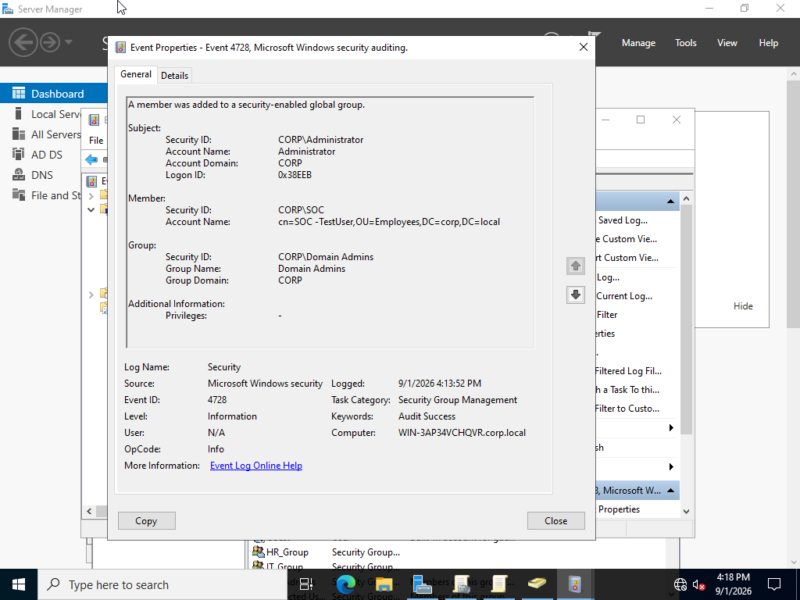
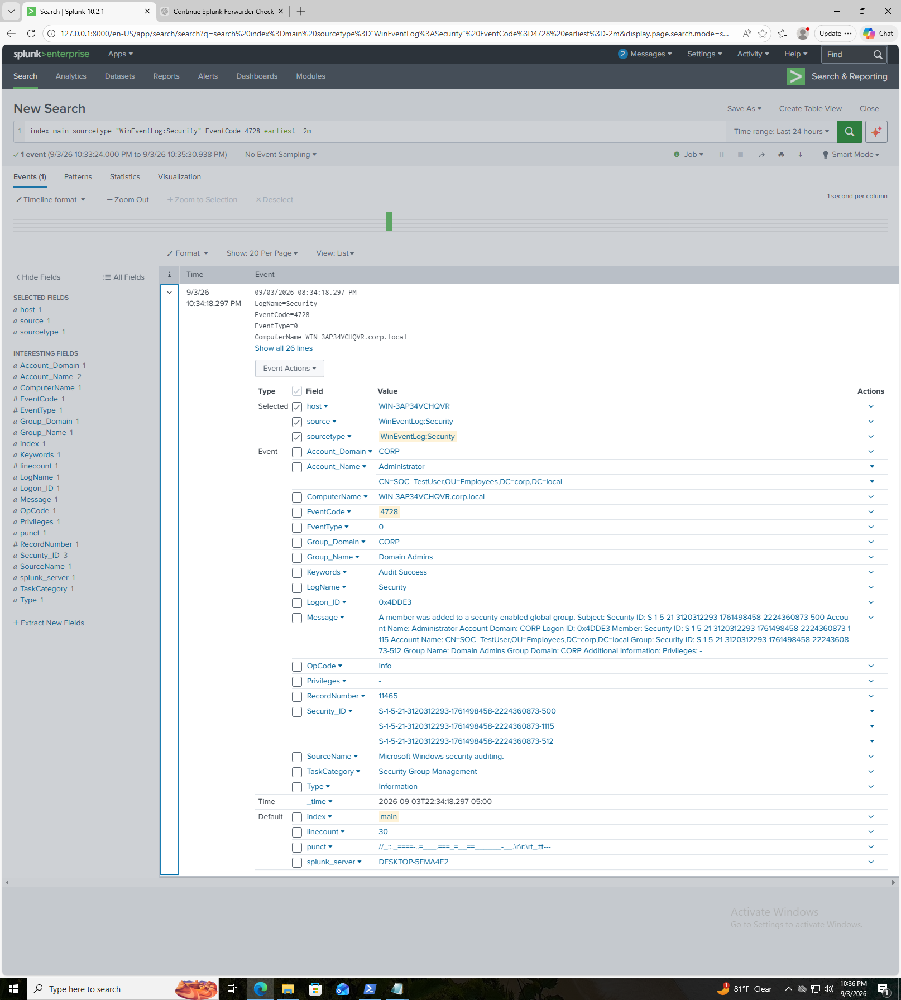
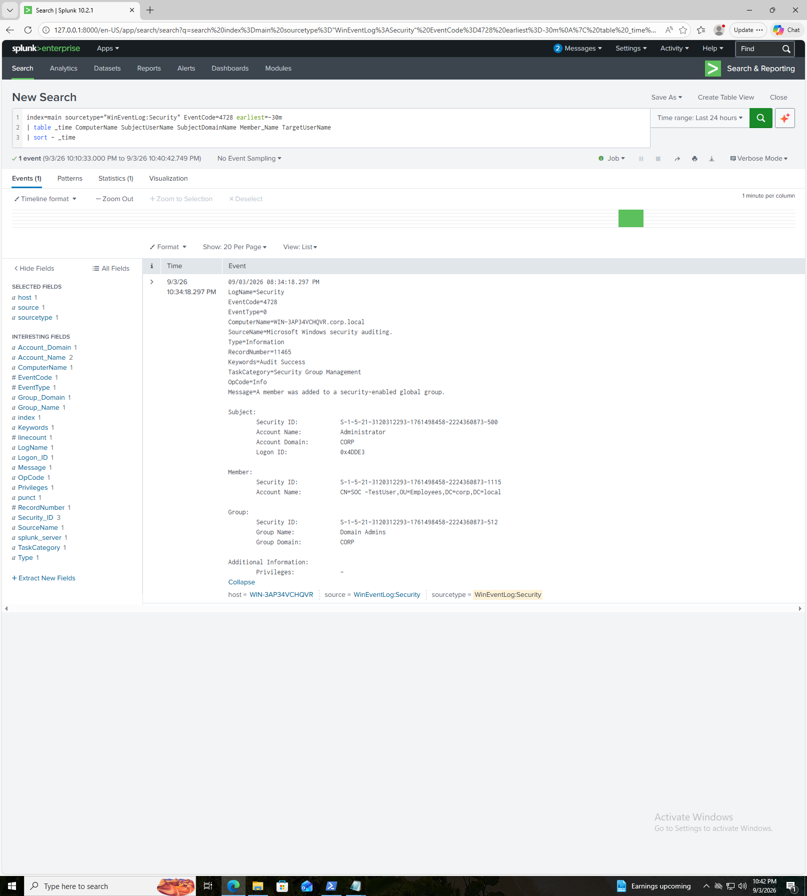
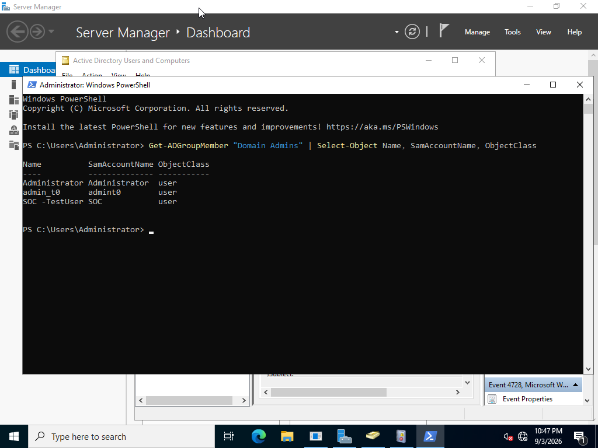
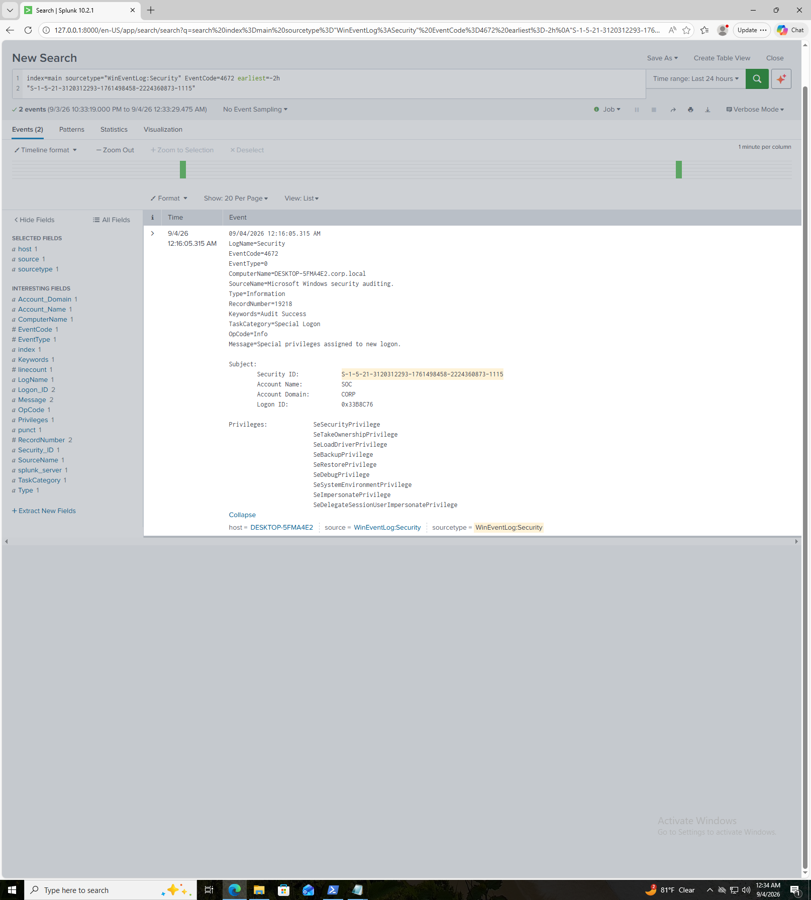

# Privileged Group Membership Monitoring & Investigation

## Overview

This lab simulates a **privilege escalation scenario** in an Active Directory environment and demonstrates how a SOC analyst can detect, investigate, and correlate privileged account activity using **Windows Security Event Logs and Splunk**.

The scenario involves a test SOC account being added to the **Domain Admins** group. Windows security auditing was then used to identify the group membership change, confirm the account's privileged status, and investigate the subsequent logon activity.

### Objectives

* Monitor privileged Active Directory group membership changes.
* Identify suspicious additions to the **Domain Admins** group.
* Correlate Windows Security Event IDs across multiple events.
* Investigate successful logon activity associated with the affected account.
* Identify privileged logons using **Event ID 4672**.
* Practice SOC-style investigation and evidence collection using Splunk.

---

## Lab Environment

| Component               | Configuration              |
| ----------------------- | -------------------------- |
| Domain Controller       | Windows Server 2022        |
| Active Directory Domain | `corp.local`               |
| SIEM                    | Splunk Enterprise          |
| Log Collection          | Splunk Universal Forwarder |
| Splunk Server           | `192.168.10.20`            |
| Forwarding Port         | TCP `9997`                 |
| Primary Log Source      | Windows Security Event Log |
| Splunk Index            | `main`                     |
| Security Sourcetype     | `WinEventLog:Security`     |

### Architecture

```text
Windows Server 2022 DC
        │
        │ Splunk Universal Forwarder
        │
        ▼
Splunk Enterprise
192.168.10.20:9997
        │
        ▼
index=main
WinEventLog:Security
```

---

# Attack Simulation

A controlled privilege escalation scenario was performed by adding the test account:

`SOC -TestUser`

to the Active Directory **Domain Admins** group.

The purpose was not to perform malicious activity, but to generate realistic Windows security telemetry that could be investigated from a SOC perspective.

---

# Investigation

## 1. Detecting the Domain Admins Group Modification

The first important event was **Event ID 4728**.

Event ID 4728 indicates that a member was added to a security-enabled global group.

The event showed:

* **Subject:** `Administrator`
* **Member:** `SOC -TestUser`
* **Group:** `Domain Admins`
* **Domain:** `CORP`
* **Computer:** `WIN-3AP34VCHQVR.corp.local`

This established that the `SOC -TestUser` account had been added to the highly privileged **Domain Admins** group.

### Splunk Search

```spl
index=main sourcetype="WinEventLog:Security" EventCode=4728
```

### Evidence



---

## 2. Identifying the Privilege Escalation

The 4728 event was investigated further to determine which account was granted elevated privileges.

The event showed that:

```text
Account Name: SOC -TestUser
Group Name: Domain Admins
Group Domain: CORP
```

The account was therefore granted membership in a group with administrative privileges across the Active Directory domain.

### Evidence



---

## 3. Investigating the Privilege Change

The 4728 event was expanded and reviewed to identify the actor, affected account, and privileged group.

The event established the relationship:

```text
Administrator
      │
      │ Added account to
      ▼
SOC -TestUser
      │
      │ Added to
      ▼
Domain Admins
```

This represents the initial privilege escalation point in the investigation.

### Evidence



---

## 4. Confirming Domain Admin Membership

The account's membership was independently verified from the Domain Controller using PowerShell.

### PowerShell

```powershell
Get-ADGroupMember "Domain Admins" |
Select-Object Name, SamAccountName, ObjectClass
```

The results confirmed that `SOC -TestUser` was a member of **Domain Admins**.

This provided independent confirmation that the account's elevated group membership was active.

### Evidence



---

# 5. Investigating the Privileged Account Logon

After confirming the account's elevated group membership, Windows Security logs were searched for successful logon activity associated with the account.

The account's Security Identifier was used for correlation:

```text
S-1-5-21-3120312293-1761498458-2224360873-1115
```

The investigation identified **Event ID 4624**, indicating a successful logon.

The event showed:

```text
EventCode: 4624
Account Name: SOC
Account Domain: CORP
Security ID: ...-1115
Logon Type: 2
Computer: DESKTOP-5FMA4E2
```

Windows recorded the account under its SAM account name, `SOC`, rather than the display name `SOC -TestUser`.

The matching Security Identifier allowed the account to be reliably correlated despite the naming difference.

### Splunk Search

```spl
index=main sourcetype="WinEventLog:Security" EventCode=4624 earliest=-2h
"S-1-5-21-3120312293-1761498458-2224360873-1115"
```

---

# 6. Detecting Special Privileges Assigned to the Account

The most significant logon-related event discovered during the investigation was **Event ID 4672**.

Event ID 4672 indicates that special privileges were assigned to a newly created logon session.

The event identified:

```text
EventCode: 4672
Account Name: SOC
Account Domain: CORP
Security ID: ...-1115
Logon ID: 0x33B8C76
```

The event included several powerful Windows privileges, including:

```text
SeSecurityPrivilege
SeTakeOwnershipPrivilege
SeLoadDriverPrivilege
SeBackupPrivilege
SeRestorePrivilege
SeDebugPrivilege
SeSystemEnvironmentPrivilege
SeImpersonatePrivilege
SeDelegateSessionUserImpersonatePrivilege
```

Of particular interest from a security-monitoring perspective was:

```text
SeDebugPrivilege
```

This privilege can allow a process to interact with or inspect other processes at a highly privileged level and is therefore important telemetry when investigating privileged account activity.

### Splunk Search

```spl
index=main sourcetype="WinEventLog:Security" EventCode=4672 earliest=-2h
"S-1-5-21-3120312293-1761498458-2224360873-1115"
```

### Evidence



---

# 7. Logon Session Correlation

The investigation attempted to identify additional Security events associated with the privileged logon session using the Logon ID:

```text
0x33B8C76
```

### Splunk Search

```spl
index=main sourcetype="WinEventLog:Security" earliest=-2h
"0x33B8C76"
| table _time EventCode ComputerName Account_Name Message
| sort _time
```

No additional events were returned for this Logon ID.

Rather than assuming additional activity occurred, the investigation documented the absence of correlated telemetry.

---

# Investigation Timeline

```text
Administrator
     │
     │ Event ID 4728
     ▼
SOC -TestUser added to Domain Admins
     │
     │
     ▼
Domain Admin membership verified
     │
     │ Event ID 4624
     ▼
SOC successfully logs on
     │
     │ Event ID 4672
     ▼
Special privileges assigned
     │
     ▼
No additional correlated events found
```

---

# Key Windows Event IDs

| Event ID | Description                                   | Investigation Relevance                     |
| -------- | --------------------------------------------- | ------------------------------------------- |
| **4728** | Member added to security-enabled global group | Detects privileged group membership changes |
| **4624** | Successful account logon                      | Identifies account authentication           |
| **4672** | Special privileges assigned to new logon      | Identifies privileged logon activity        |

---

# SOC Analyst Findings

The investigation successfully demonstrated how multiple Windows Security events can be correlated to identify a potential privilege escalation scenario.

### Finding

The `SOC -TestUser` account was added to the **Domain Admins** group by the `Administrator` account. The account's membership was independently verified through Active Directory.

A subsequent successful logon associated with the account's Security Identifier was identified. Windows then generated **Event ID 4672**, showing that the logon session received multiple special privileges.

### Detection Chain

```text
4728
Privileged group membership change
        ↓
AD membership verification
        ↓
4624
Successful logon
        ↓
4672
Special privileges assigned
        ↓
SOC investigation
```

### Analyst Assessment

The combination of a **Domain Admins membership change**, subsequent account authentication, and **special privileges assigned to the logon session** represents activity that should receive elevated scrutiny in a production environment.

A SOC analyst encountering this sequence should validate:

* Whether the Domain Admins change was authorized.
* Who initiated the change.
* Whether the affected account normally requires Domain Admin privileges.
* The source workstation associated with the logon.
* Additional activity performed by the account.
* Whether the account should remain a member of the privileged group.
* Whether additional authentication or process telemetry indicates compromise.

---

# Skills Demonstrated

* Active Directory security monitoring
* Privileged account monitoring
* Windows Security Event Log analysis
* Splunk SIEM investigation
* Event ID 4728 analysis
* Event ID 4624 analysis
* Event ID 4672 analysis
* Security Identifier correlation
* Logon ID correlation
* Privilege escalation detection
* SOC alert investigation
* Evidence collection and documentation
* PowerShell Active Directory administration
* Security event timeline construction

---

# Conclusion

This lab demonstrated a practical SOC investigation of a simulated Active Directory privilege escalation.

By correlating **Event IDs 4728, 4624, and 4672**, the investigation followed the affected account from a privileged group membership change through authentication and assignment of special Windows privileges.

The lab also demonstrated an important SOC principle: **individual events become more valuable when correlated into an activity timeline rather than analyzed in isolation.**

