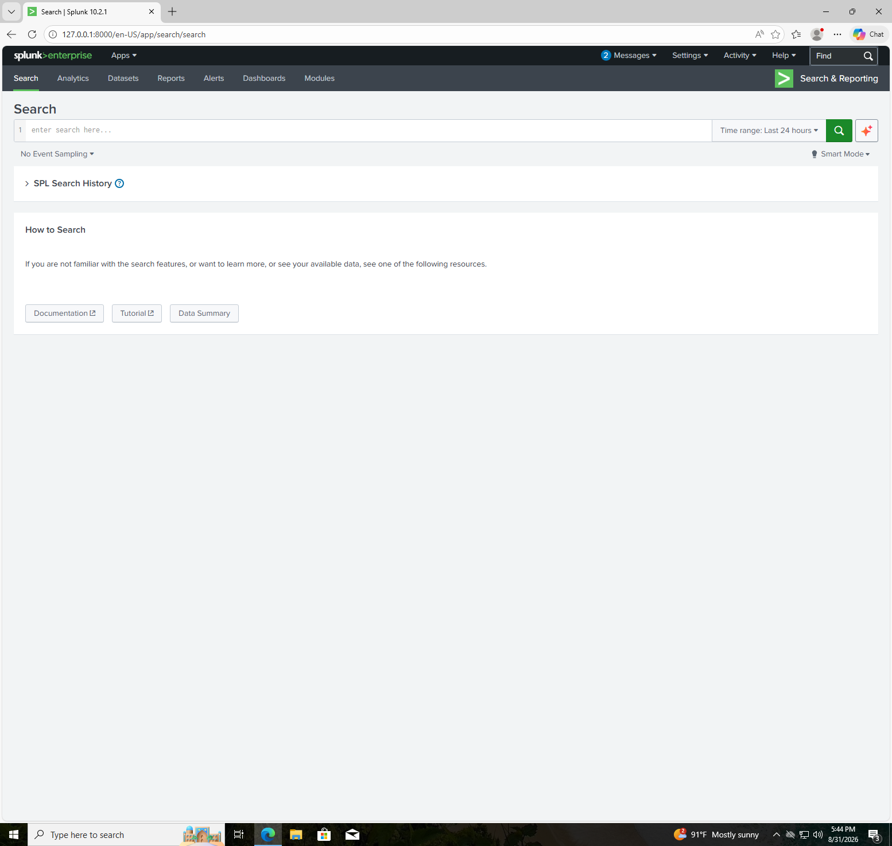
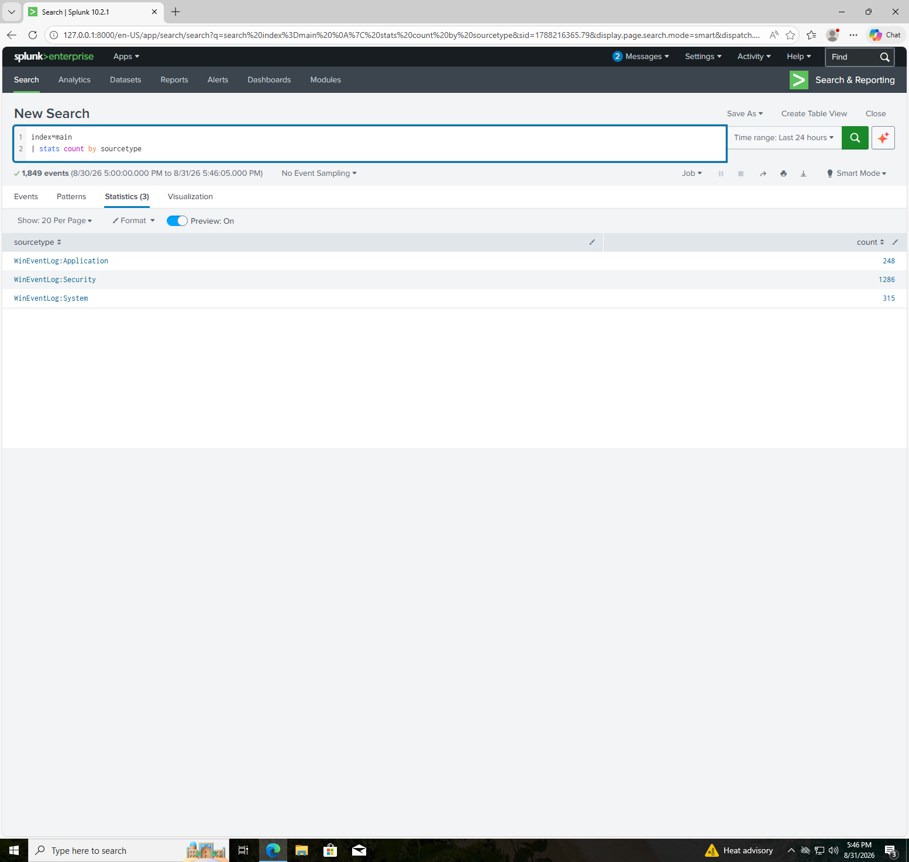
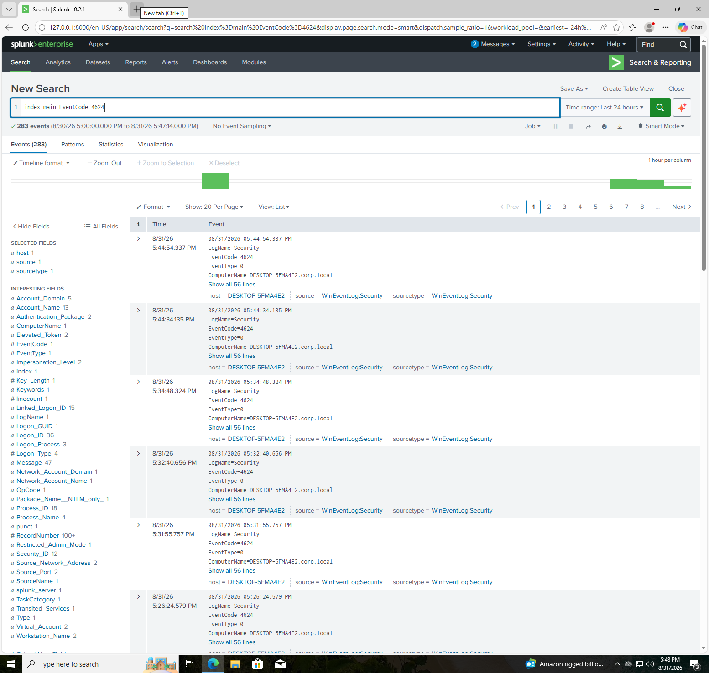
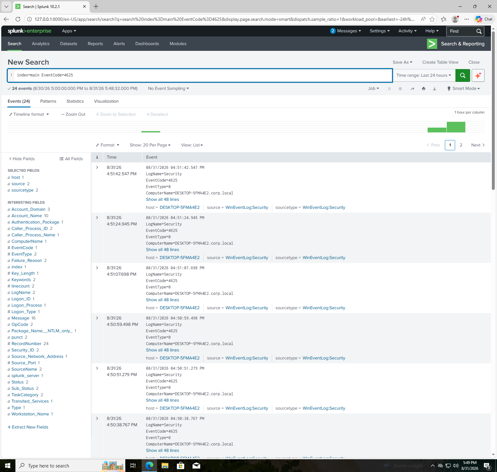
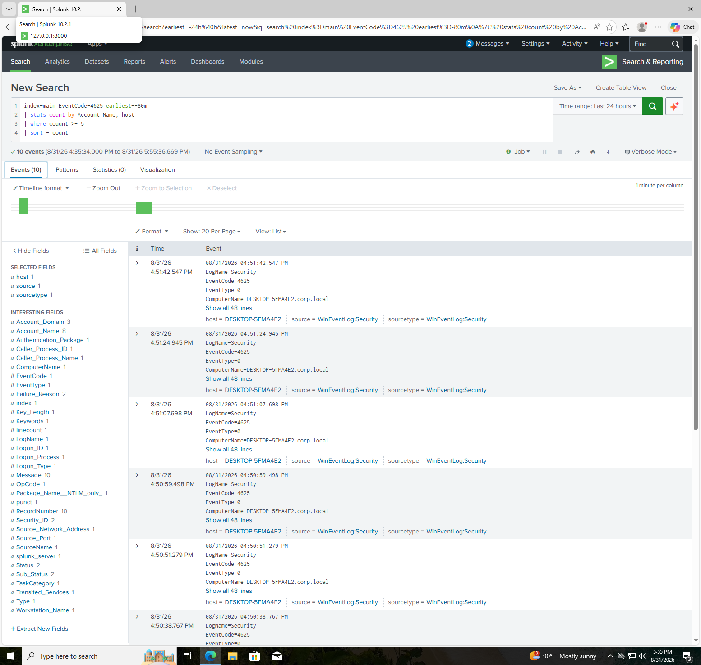
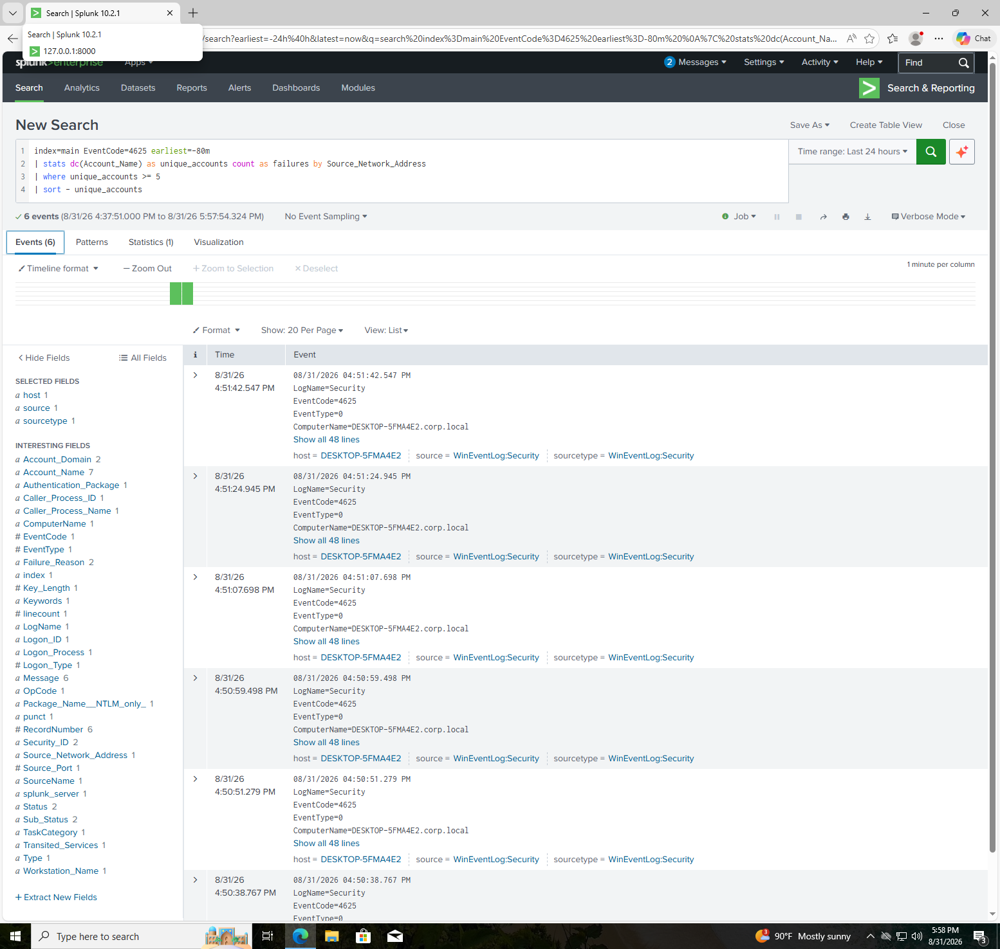
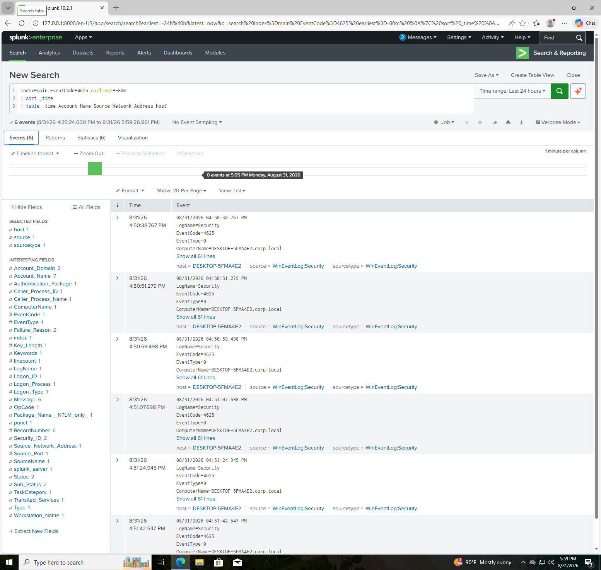
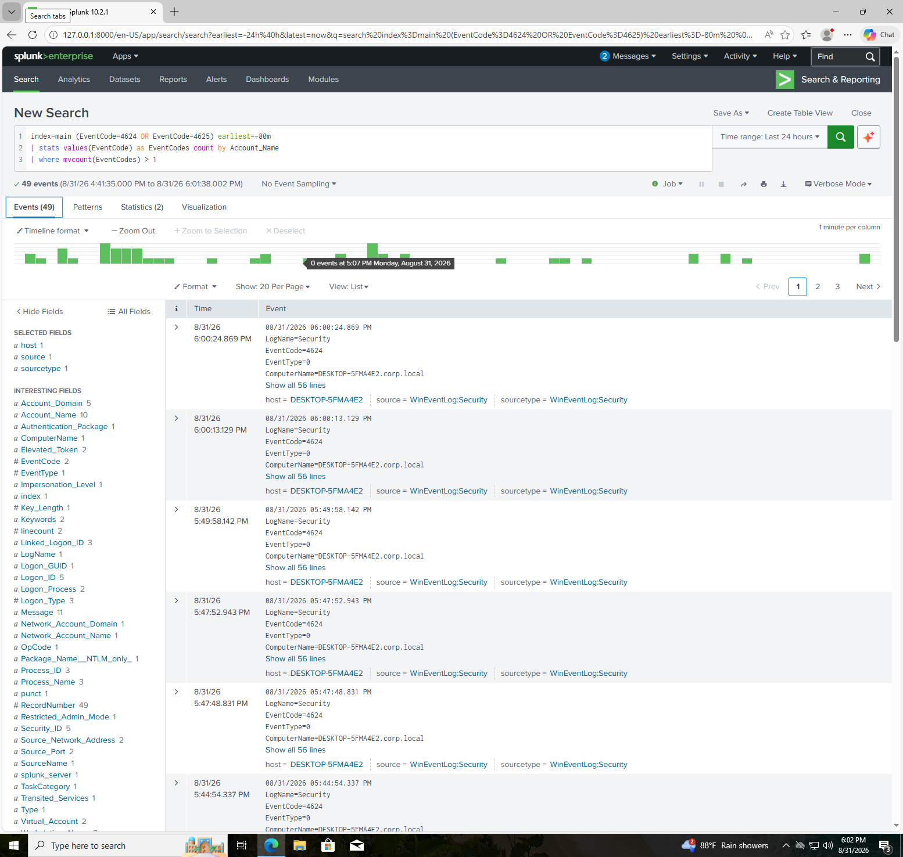

# Splunk SOC Detection & Authentication Monitoring Lab

## Overview

This project demonstrates the use of Splunk as a Security Information and Event Management (SIEM) platform to collect, analyze, and investigate Windows authentication events.

A Windows workstation was used as the primary log source and Windows Event Logs were forwarded to Splunk for analysis. Controlled authentication failures were generated to simulate brute-force and password-spray activity. Splunk Search Processing Language (SPL) was then used to identify suspicious authentication patterns, investigate affected accounts and source systems, construct activity timelines, and correlate successful and failed authentication events.

This lab focuses on practical Security Operations Center (SOC) skills including log analysis, detection engineering, authentication monitoring, attack simulation, and incident investigation.

> **Environment:** Controlled home lab
> **SIEM:** Splunk Free
> **Primary Log Source:** Windows Security Event Logs
> **Activity:** Controlled authentication simulations

---

## Objectives

* Validate Windows log ingestion into Splunk
* Analyze Windows authentication events
* Investigate successful and failed logon activity
* Analyze Windows Event ID 4624 and Event ID 4625
* Simulate repeated failed authentication attempts
* Develop a brute-force detection
* Simulate password-spray activity
* Develop a password-spray detection
* Identify source network addresses associated with authentication failures
* Construct an authentication activity timeline
* Correlate successful and failed authentication events
* Practice SOC-style alert investigation and analysis

---

## Lab Environment

| Component       | Description                           |
| --------------- | ------------------------------------- |
| SIEM            | Splunk Free                           |
| Log Source      | Windows workstation                   |
| Host            | `DESKTOP-5FMA4E2`                     |
| Log Types       | Application, System, Security         |
| Security Events | Windows Event IDs 4624 and 4625       |
| Log Forwarding  | Splunk Universal Forwarder            |
| Testing         | Controlled authentication simulations |

---

## Architecture

```text
Windows Workstation
DESKTOP-5FMA4E2
        |
        | Windows Event Logs
        v
Splunk Universal Forwarder
        |
        v
Splunk
        |
        v
Search & Reporting
        |
        +-------------------------+
        |                         |
        v                         v
4624 Successful             4625 Failed
Authentication             Authentication
        |                         |
        +------------+------------+
                     |
                     v
              SPL Detection
                     |
                     v
             SOC Investigation
```

---

# 1. Splunk Environment Validation

The existing Splunk virtual machine was recovered and validated before beginning the detection exercises.

Splunk Web was accessible and the Splunk service was confirmed to be running. The internal `_internal` index was also queried successfully, confirming that the Splunk search environment was operational.

### Screenshot



---

# 2. Windows Log Ingestion

Windows Event Logs were successfully ingested into Splunk from the lab workstation.

The following Windows sourcetypes were identified:

* `WinEventLog:Application`
* `WinEventLog:System`
* `WinEventLog:Security`

### SPL

```spl
index=* | stats count by sourcetype
```

This confirmed that Windows event data was available within the Splunk environment.

### Screenshot



---

# 3. Successful Authentication Monitoring — Event ID 4624

Windows Event ID **4624** represents a successful logon.

The following search was used to identify successful authentication events:

```spl
index=main EventCode=4624
```

Successful authentication activity was observed from the Windows workstation.

Monitoring successful authentication events provides a baseline for investigating account activity and correlating authentication attempts.

### Screenshot



---

# 4. Failed Authentication Monitoring — Event ID 4625

Windows Event ID **4625** represents a failed logon.

The following search was used to identify failed authentication events:

```spl
index=main EventCode=4625
```

Controlled failed authentication attempts were generated against test accounts to validate that Windows Security events were being forwarded to Splunk.

### Screenshot



---

# 5. Brute-Force Detection

A controlled brute-force scenario was simulated by generating multiple failed authentication attempts against the same test account.

The test account `jsmith` generated seven failed authentication events.

The following SPL query was used to identify accounts experiencing five or more failed logons within a five-minute window:

```spl
index=main EventCode=4625 earliest=-5m
| stats count by Account_Name, host
| where count >= 5
| sort - count
```

### Detection Logic

```text
One Account
     |
     v
Multiple Failed Logons
     |
     v
5+ Attempts Within 5 Minutes
     |
     v
Potential Brute-Force Activity
```

The detection successfully identified the simulated activity associated with `jsmith`.

### Screenshot



---

# 6. Password-Spray Detection

A controlled password-spray scenario was simulated by generating failed authentication attempts against multiple different accounts from the same source system.

Unlike a traditional brute-force attack, password spraying distributes authentication attempts across multiple accounts rather than repeatedly targeting a single account.

The following SPL query was used to identify a source associated with failed authentication against five or more unique accounts:

```spl
index=main EventCode=4625 earliest=-15m
| stats dc(Account_Name) as unique_accounts count as failures by Source_Network_Address
| where unique_accounts >= 5
| sort - unique_accounts
```

### Detection Logic

```text
One Source
     |
     v
Multiple Target Accounts
     |
     v
Failed Authentication
     |
     v
5+ Unique Accounts
     |
     v
Potential Password Spray
```

The detection successfully identified the controlled password-spray pattern generated during the lab.

### Screenshot



---

# 7. Password-Spray Timeline Investigation

After identifying the suspicious authentication pattern, the events were placed into chronological order to establish an activity timeline.

### SPL

```spl
index=main EventCode=4625 earliest=-15m
| sort _time
| table _time Account_Name Source_Network_Address host
```

The resulting timeline showed multiple accounts receiving failed authentication attempts from the same source.

This type of timeline analysis helps an analyst determine:

* When the activity began
* Which accounts were targeted
* The order of authentication attempts
* The source associated with the activity
* The frequency of authentication attempts

### Screenshot



---

# 8. Authentication Event Correlation

Successful and failed authentication events were correlated to determine whether individual accounts experienced both event types during the investigation window.

### SPL

```spl
index=main (EventCode=4624 OR EventCode=4625) earliest=-30m
| stats values(EventCode) as EventCodes count by Account_Name
| where mvcount(EventCodes) > 1
```

The investigation identified accounts that had both successful and failed authentication events during the selected period.

The `Administrator` account appeared in both event categories.

This demonstrates the importance of correlating multiple authentication event types rather than analyzing individual events in isolation.

### Investigation Concept

```text
4625 Failed Authentication
          |
          v
   Account Activity
          |
          v
4624 Successful Authentication
          |
          v
   Further Investigation
```

Because this was a controlled home-lab environment, the presence of both event types was **not treated as evidence of an actual account compromise**.

The correlation was used to demonstrate how a SOC analyst could identify accounts requiring additional investigation.

### Screenshot



---

# Detection Summary

| Detection                  | Event ID    | Detection Logic                                                  | Result                 |
| -------------------------- | ----------- | ---------------------------------------------------------------- | ---------------------- |
| Failed Authentication      | 4625        | Identify failed logons                                           | Successfully validated |
| Brute Force                | 4625        | 5+ failures against an account within 5 minutes                  | Successfully detected  |
| Password Spray             | 4625        | 5+ unique accounts targeted by a source within 15 minutes        | Successfully detected  |
| Authentication Correlation | 4624 / 4625 | Identify accounts with both successful and failed authentication | Successfully validated |

---

# Investigation Findings

The lab demonstrated that Splunk can successfully ingest and analyze Windows authentication telemetry and identify suspicious authentication patterns.

### Key Findings

1. Windows Security events were successfully forwarded to Splunk.
2. Event ID 4624 was successfully identified and analyzed.
3. Event ID 4625 was successfully identified and analyzed.
4. Repeated failed authentication against a single account was detected as potential brute-force activity.
5. Failed authentication against multiple accounts from the same source was detected as potential password-spray activity.
6. Source network information was used to identify the origin associated with the authentication attempts.
7. Authentication events were placed into chronological timelines for investigation.
8. Successful and failed authentication events were correlated to provide additional context.

---

# Splunk Free Limitation

This project was performed using **Splunk Free**.

The available license allowed Windows logs to be ingested and analyzed using SPL. However, automated alerting functionality required for configuring and validating a scheduled Splunk alert was not available in the current environment.

As a result, the detection rules were **developed and manually validated through SPL searches** rather than configured as automated production alerts.

The limitation was documented as part of the lab rather than bypassed.

---

# Security Recommendations

In a production environment, repeated authentication failures and password-spray activity should be investigated using additional context and organizational baselines.

Potential response actions include:

* Validate whether the affected accounts are legitimate users.
* Identify the source workstation or IP address.
* Review successful authentication events following failed attempts.
* Investigate authentication activity across additional systems.
* Review unusual geographic, network, or device activity.
* Reset credentials when account compromise is suspected.
* Temporarily disable compromised accounts when appropriate.
* Enforce multi-factor authentication.
* Implement appropriate account lockout and authentication controls.
* Monitor privileged accounts with additional detection rules.
* Configure automated SIEM alerting and escalation procedures when supported.

---

# Skills Demonstrated

### SIEM & Log Analysis

* Splunk
* SPL
* Windows Event Log analysis
* Security event monitoring
* Log ingestion validation

### Detection Engineering

* Brute-force detection
* Password-spray detection
* Threshold-based detection
* Time-window analysis
* Authentication event correlation

### SOC Investigation

* Event triage
* Timeline construction
* Source identification
* Account investigation
* Authentication analysis
* Detection validation

### Windows Security

* Event ID 4624
* Event ID 4625
* Windows Security logs
* Authentication monitoring

---

# Lessons Learned

This lab demonstrated the importance of analyzing authentication events as patterns rather than treating individual log entries as isolated incidents.

A traditional brute-force detection can focus on repeated failures against a single account, while password-spray activity distributes attempts across multiple accounts. Effective detection therefore requires different detection strategies and appropriate time windows.

The lab also demonstrated the importance of correlating successful and failed authentication events when investigating potential account compromise.

Most importantly, the project reinforced the SOC workflow:

```text
Collect
   ↓
Search
   ↓
Detect
   ↓
Investigate
   ↓
Correlate
   ↓
Determine Risk
   ↓
Respond
```

---

# Project Status

**Completed**

This lab successfully demonstrated Windows authentication monitoring, Splunk log analysis, brute-force detection, password-spray detection, timeline investigation, and authentication event correlation within a controlled cybersecurity home-lab environment.

